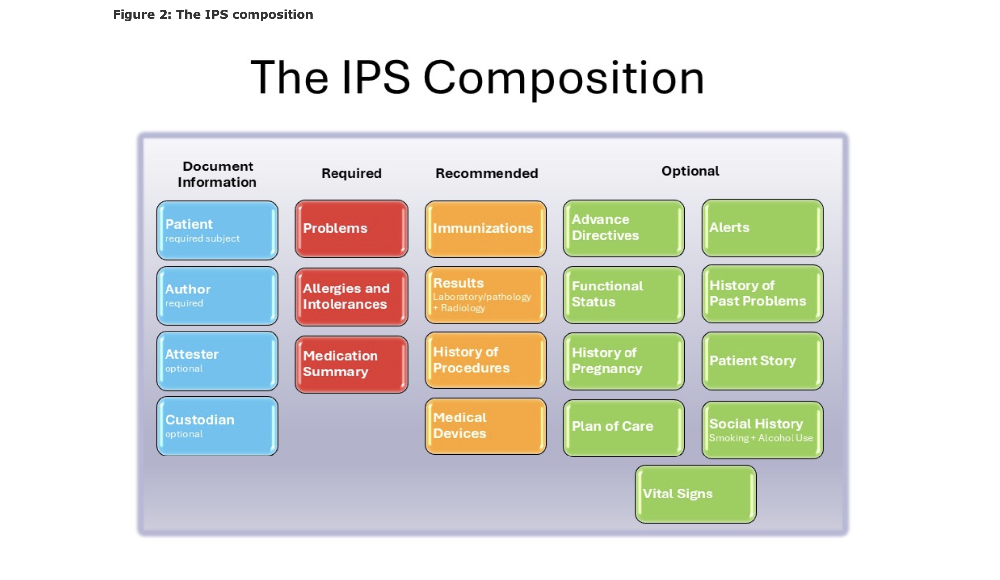

# OpenMRS3 IPS SETUP

1. Spin up the services

```
 docker-compose up -d
```

Acces the services at 

| Instance  |     URL       | credentials (user : password)|
|---------- |:-------------:|------:                       |
| SHR      | http://localhost:8090/fhir  |   | 


2. Load demo data 

 ```
  ./load.sh
 ```

 3. Generate IPS by Posting the following Parameters ie Patient ID to this FHIR end point ```http://localhost:8090/fhir/Patient/$summary```
   
    ```
        {
            "resourceType": "Parameters",
            "parameter": [{
                "name": "identifier",
                "valueIdentifier": {
                "value": "10001MJ"
                }
            }]
        } 
    ```

    See IPS composition

    

    see more about [IPS](https://build.fhir.org/ig/HL7/fhir-ips/)


